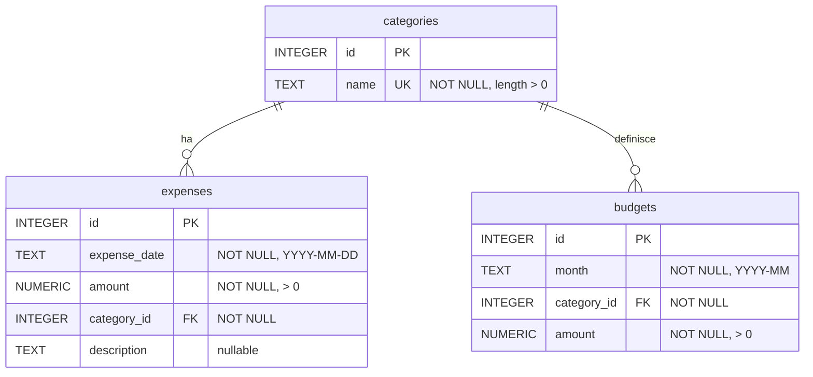

# Schema logico del database

Rappresentazione logica delle tabelle e delle relazioni del database
del Sistema di Gestione delle Spese Personali.

## Diagramma ER

```mermaid
erDiagram
    categories {
        INTEGER id PK
        TEXT name UK "NOT NULL, length > 0"
    }
    expenses {
        INTEGER id PK
        TEXT expense_date "NOT NULL, YYYY-MM-DD"
        NUMERIC amount "NOT NULL, > 0"
        INTEGER category_id FK "NOT NULL"
        TEXT description "nullable"
    }
    budgets {
        INTEGER id PK
        TEXT month "NOT NULL, YYYY-MM"
        INTEGER category_id FK "NOT NULL"
        NUMERIC amount "NOT NULL, > 0"
    }

    categories ||--o{ expenses : "ha"
    categories ||--o{ budgets : "definisce"
```
